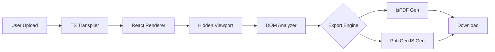

<div align="center">
  <h1>TSX2Slides</h1>
  <h3>Enterprise-Grade React Component to Presentation Converter</h3>
  <p><strong>Transform your React UI into professional PDF and PowerPoint presentations instantly.</strong></p>

  [](https://opensource.org/licenses/MIT)
  [](https://www.typescriptlang.org/)
  [](https://reactjs.org/)
  [](https://vitejs.dev/)
  [](https://www.docker.com/)

</div>

---

## 📖 Table of Contents

- [Overview](#-overview)
- [Key Features](#-key-features)
- [Architecture](#-architecture)
- [Prerequisites](#-prerequisites)
- [Installation & Local Development](#-installation--local-development)
  - [Windows Setup](#windows-setup)
- [Deployment](#-deployment)
  - [Docker](#docker-deployment)
- [Usage Guide](#-usage-guide)
- [Project Structure](#-project-structure)
- [Technical Capabilities](#-technical-capabilities)
- [License](#-license)

---

## 🎯 Overview

**TSX2Slides** is a high-performance, privacy-centric application designed for enterprise environments. It allows developers and designers to convert React TSX/JSX components into pixel-perfect PDF documents and editable PowerPoint (PPTX) presentations.

Unlike traditional screenshot-based tools, TSX2Slides performs a deep DOM analysis to map HTML/CSS structures directly to presentation primitives. This ensures text remains selectable, vector graphics stay sharp, and layouts are preserved with high fidelity.

**Why TSX2Slides?**
- **🔒 Zero Data Leakage**: All processing is performed client-side within the browser. No code or data is ever sent to a server.
- **⚡ Offline Capable**: Fully functional without an internet connection after initial load.
- **🎨 Design System Compatible**: Reuse your existing React component library for presentations.

---

## ✨ Key Features

### Core Capabilities
- **Dual-Format Export**: Generate A4 Landscape PDFs and 16:9 PowerPoint presentations simultaneously.
- **Live Preview**: Real-time rendering of your TSX/JSX code before export.
- **Drag & Drop Interface**: Seamless file loading experience.
- **TypeScript Support**: Built-in transpiler supports modern TypeScript syntax out of the box.

### Advanced Rendering Engine
- **Smart Gradient Handling**: Automatically converts complex CSS gradients into high-fidelity images or calculates dominant colors for solid fallbacks, ensuring compatibility with PDF/PPTX standards.
- **Intelligent Font Mapping**: robust font fallback system that maps web fonts (e.g., Inter, Roboto) to standard system fonts (Arial, Helvetica) to guarantee consistent rendering across different operating systems.
- **DOM-to-Vector Mapping**: Precise calculation of element positions, dimensions, and styles.

---

## 🏗️ Architecture

TSX2Slides utilizes a sophisticated browser-based pipeline to process React components:



1.  **Ingestion**: TSX code is transpiled in-memory using a lightweight TypeScript compiler.
2.  **Rendering**: The component is mounted in a sandboxed, hidden container (1280x720).
3.  **Analysis**: The `DomWalker` service traverses the visual tree, extracting computed styles, geometry, and text content.
4.  **Synthesis**: The extracted data is mapped to `jsPDF` and `PptxGenJS` primitives for document generation.

---

## 📋 Prerequisites

- **Node.js**: v18.x or higher (v20 LTS recommended)
- **npm**: v9.x or higher
- **Docker** (Optional): For containerized deployment

---

## 🚀 Installation & Local Development

### Standard Setup

1.  **Clone the repository**
    ```bash
    git clone https://github.com/nowusman/tsx2slides.git
    cd tsx2slides
    ```

2.  **Install dependencies**
    ```bash
    npm install
    ```

3.  **Start the development server**
    ```bash
    npm run dev
    ```
    Access the app at `http://localhost:5173`.

### Windows Setup

For users on Windows, we recommend using PowerShell.

1.  **Open PowerShell as Administrator** (optional, but recommended for avoiding permission issues).
2.  **Execution Policy**: Ensure you can run scripts if you encounter errors.
    ```powershell
    Set-ExecutionPolicy -ExecutionPolicy RemoteSigned -Scope CurrentUser
    ```
3.  **Run the App**:
    ```powershell
    npm run dev
    ```

---

## 📦 Deployment

TSX2Slides is designed to be deployed as a static web application. We provide official Docker support for easy containerization.

### Docker Deployment

1.  **Build the Docker Image**
    ```bash
    docker build -t tsx2slides .
    ```

2.  **Run the Container**
    ```bash
    docker run -d -p 8080:80 --name tsx2slides-app tsx2slides
    ```
    The application will be available at `http://localhost:8080`.

### Using Docker Compose

For convenience, a `docker-compose.yml` is included.

```bash
docker-compose up -d --build
```

### Static Hosting

You can also deploy to any static hosting provider (Vercel, Netlify, AWS S3, etc.) by building the project:

```bash
npm run build
# The 'dist' folder contains the production-ready static files.
```

---

## 📖 Usage Guide

1.  **Launch the Application**: Open your browser and navigate to the deployed URL (e.g., `http://localhost:5173`).
2.  **Prepare Your Component**: Ensure your React component is in a `.tsx` file.
    *   *Tip*: Use standard CSS or inline styles for best results.
3.  **Upload**:
    *   **Single File**: Drag and drop your `.tsx` file into the upload zone, or click to select.
    *   **Project Mode**: Use "Upload Folder" or "Upload Zip" to load a project that contains your TSX, CSS, and assets. Choose the entry file if prompted.
4.  **Preview & Verify**: The application will render your component. Check the preview to ensure everything looks correct.
5.  **Export**:
    *   **PDF**: Click "Export PDF" for a high-quality A4 landscape document.
    *   **PPTX**: Click "Export PowerPoint" for an editable slide deck.

### Raster Fallback (Optional)

If the renderer detects missing imports or missing CSS, it will fall back to a pixel-perfect raster slide (PNG) to preserve layout fidelity. This will be clearly indicated in the UI so you know when the export is no longer editable text.

---

## 📂 Project Structure

```
tsx2slides/
├── components/          # UI Components (Layout, Previews, etc.)
├── services/            # Core Logic Services
│   ├── generatorService.ts # Main orchestration
│   ├── domWalker.ts        # DOM traversal & analysis
│   ├── layoutEngine.ts     # Geometry calculations
│   ├── gradientHandler.ts  # CSS Gradient processing
│   └── fontMapper.ts       # Font compatibility layer
├── tests/               # Sample TSX slides for testing
├── App.tsx              # Main Application Entry
├── Dockerfile           # Container configuration
├── docker-compose.yml   # Docker orchestration
└── vite.config.ts       # Build configuration
```

---

## 🛠️ Technical Capabilities

| Feature | Support Level | Implementation Details |
|---------|---------------|------------------------|
| **Text** | Full | Accurate font sizing, color, and alignment. |
| **Images** | Full | Extracts `` tags and background images. |
| **Gradients** | High | Auto-converts to image or solid fallback. |
| **Borders** | Medium | Basic border styles supported; complex styles simplified. |
| **Flexbox/Grid** | Full | Captured via computed layout geometry. |
| **Animations** | None | Static capture only (first frame/state). |

---

## 🤝 Contributing

We welcome contributions! Please follow these steps:

1.  Fork the repository.
2.  Create a feature branch (`git checkout -b feature/amazing-feature`).
3.  Commit your changes (`git commit -m 'Add some amazing feature'`).
4.  Push to the branch (`git push origin feature/amazing-feature`).
5.  Open a Pull Request.

---

## 📄 License

This project is licensed under the MIT License - see the [LICENSE](LICENSE) file for details.
